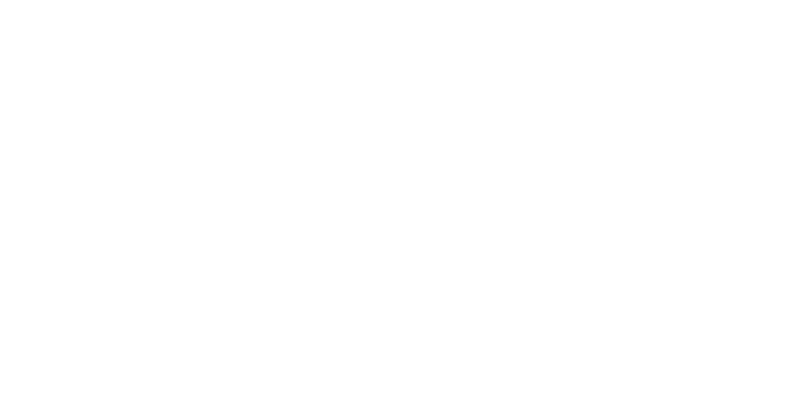

# 

# Presentation

In the realm of tabletop role-playing games, Eidos stands as a unique and innovative addition to the genre. Rooted in the principles of open source development, this game is designed to be both immersive and accessible, offering a deep and rich narrative experience that is driven by player choice. The game's mechanics are based on a six-sided die, making it accessible to players of all skill levels, and its GPLv3 license ensures that the game remains open and freely available to all who wish to play it.

Eidos takes its name from the ancient Greek concept of the world of ideas, reflecting the game's focus on immersive and thought-provoking narratives. This name is a nod to the idea that in role-playing games, players have the ability to explore and interact with an imagined world filled with endless possibilities.

The character creation process in Eidos is a deep and engaging experience, allowing players to build their characters from the ground up. With character sheets devoted to personality, religion, physical description, background, clothing, equipment, and skills, players have the tools to create a truly unique and memorable character.

The combat system in Eidos is designed to be immersive and engaging, with mechanics that are designed to create dynamic and exciting combat scenes. The game's mechanics are based on classic combat narratives, and the system strives to be a simulation of combat rather than simply a turn-based dice-rolling game. The standard rules are designed to be played in a pre-modern low-fantasy setting, but the game is easily adaptable to other role-playing scenarios.

This rulebook is divided into six chapters, each of which covers a different aspect of the game. Chapter 1: Character Creation provides a detailed guide to creating your character, including sections on personality, religion, physical description, background, clothing, equipment, and skills. Chapter 2: Combat and Combat Resolution covers the mechanics of combat in Eidos, including basic combat mechanics, ability checks, skills, tactical maneuvering, environmental interaction, morale, reinforcements, ranged combat, unarmed combat, weapon mechanics, grappling, healing, shields and armor, mounted combat, naval combat, aerial combat, siege weapons, traps, stealth, mass combat, and death and dying.

Chapter 3: Survival Mechanics covers the mechanics of survival in Eidos, including food and water requirements, shelter, scavenging, travel, and exploration. Chapter 4: Character Injuries and Health provides a comprehensive guide to character injuries and health, including damage and wound mechanics, healing and recovery, status effects, and advanced injuries and trauma.

Chapter 5: Game Master Tools provides a guide to running Eidos games, including world-building, NPC generation, encounters, group dynamics, movement and travel, encounter generation, and campaign management. Chapter 6: Optional Rules and Variants covers alternative systems for combat, magic, and skills, as well as advanced mechanics for character development and progression and rules for playing in different settings and genres.

In conclusion, Eidos is an open source tabletop RPG system that offers a unique and engaging narrative experience, with mechanics that are designed to create immersive and exciting combat scenes. With its deep character creation process, engaging combat mechanics, and comprehensive survival mechanics, Eidos is a game that offers endless possibilities for players to explore and experience.

# Table of Contents

## Character Creation

- [Personality](./personality.md)
- [Religion and Spirituality](./religion.md)      
- [Physical Description](./physical.md) 
- [Background](./background.md)
- [Clothing](./clothing.md)  
- [Equipment and Possessions](./equipment.md)      
- [Skills](./skills.md)

## Combat

- [Basic Combat Mechanics](./combat.md#basic-combat-mechanics)
- Ability Checks and Skills
- Experience and Leveling
- Tactical Maneuvers and Formation Tactics
- Environmental Interaction and Terrain Effects
- Morale and Panic Mechanics
- Reinforcements and Retreat Mechanics
- Archery and Ranged Combat Mechanics
- Throwing Weapons and Grenades
- Ballistics and Cover Mechanics
- Ammunition and Reloading Mechanics
- Unarmed Combat Mechanics
- Light and Heavy Weapon Mechanics
- Dual Wielding Mechanics
- Grappling and Pinning Mechanics
- Status Effects and Conditions
- Critical Hits and Critical Fails Mechanics
- Healing and Regeneration Mechanics
- Shield and Armor Mechanics
- Mounted Combat Mechanics
- Naval Combat Mechanics
- Aerial Combat Mechanics
- Siege Weapons Mechanics
- Traps and Ambush Mechanics
- Stealth Mechanics
- Mass Combat Mechanics
- Death and Dying Mechanics

## [Health & Survival](health.md)

- Food and Water Requirements
- Shelter and Environmental Hazards
- Scavenging and Resource Management
- Travel and Exploration Mechanics
- Damage and Wound Mechanics
- Healing and Recovery Mechanics
- Status Effects and Debuffs
- Advanced Injuries and Trauma

## [DM Tools](dm.md)

- World Building and Setting Creation
- Non-Player Character Generation
- Encounters and Adventures
- Group Dynamics and Leadership in Party Movement
- Movement and Travel Mechanics
- Encounter Generation and Management
- Resource Management and Resting Mechanics
- Campaign Management

