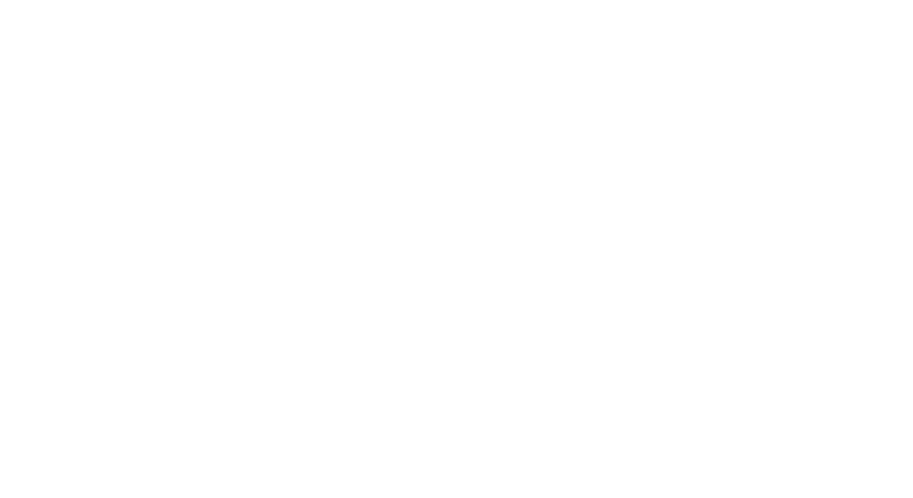
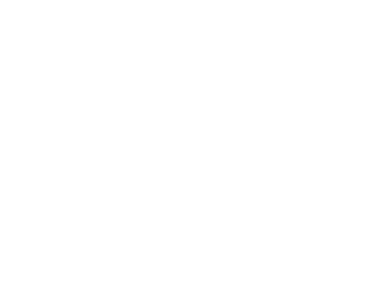

# Personality

Most of this part will be based in the [Ash’s Guide to RPG Personality & Background](https://www.ashami.com/rpg/). Of course it its not a carbon copie, some modifications will be needed to fit his tables in the system. Anyway, credits must be given and you should check out his guide.

## Primary Motivators

The first step in crafting a character's personality is selecting their primary and secondary motivators. These motivations serve as the driving force behind a character's actions and decisions, shaping the narrative of their journey. The primary motivator is particularly important, as it acts as the primary catalyst for a character's backstory and personality. It is the underlying theme of a character's motivations, guiding their behavior and propelling them forward.

When choosing these motivations, it's important to consider what your character wants most in the world. Is it wealth, power, love, revenge, or something else? By focusing on these motivations, players can ensure that their character's actions feel authentic and grounded in their personal desires. Whether facing challenges in combat or navigating complex social situations, characters driven by strong motivators will always have a clear direction and purpose.

| No. | Theme                | Description                                            |
|-----|----------------------|--------------------------------------------------------|
| 1   | Achievement          | To overcome obstacles and succeed; to become the best  |
| 2   | Acquisition          | To obtain possessions/wealth                           |
| 3   | Adoration            | To be cherished, admired, and wanted by others         |
| 4   | Balance/Peace        | To bring all things into harmony and equilibrium        |
| 5   | Beneficence          | To protect the helpless, heal the sick, feed the hungry, etc. |
| 6   | Chaos                | To disrupt, to cause confusion and discord              |
| 7   | Competition          | To seek out or create rule-based win/lose scenarios; to defeat others in contests |
| 8   | Conflict             | To seek out or create rivalry, fighting, or animosity   |
| 9   | Conquest             | To conquer other peoples, to bring them into one’s own culture/rule |
| 10  | Corruption           | To despoil, ruin, humiliate, or make depraved           |
| 11  | Creation             | To build or make new, such as art, culture, invention, design, etc. |
| 12  | Destruction          | To annihilate, exterminate, and unmake                  |
| 13  | Discovery/Adventure  | To explore, uncover mysteries, and pioneer              |
| 14  | Domesticity          | To get married, have children, and live a family life   |
| 15  | Education            | To provide information, teach, enlighten, or train      |
| 16  | Entertainment        | To entertain, amuse, and delight others                 |
| 17  | Enslavement          | To force others into servitude                          |
| 18  | Hedonism             | To enjoy all things sensuous                            |
| 19  | Heroism              | To find valor and honor through battle or self-sacrifice |
| 20  | Liberation           | To free the self and/or others from perceived captivity or enslavement |
| 21  | Love                 | To experience/share affection and emotional commitment, romantic or platonic |
| 22  | Nobility/Honor       | To exalt ideals such as generosity, honesty, bravery, and courtliness |
| 23  | Order                | To arrange, organize, and reduce chaos                  |
| 24  | Play                 | To have fun, to enjoy life                              |
| 25  | Power                | To control and lead others                              |
| 26  | Proselytization      | To spread a belief system; indoctrinate others          |
| 27  | Purity               | To achieve a state of moral or spiritual perfection, of self and/or others |
| 28  | Rebellion            | To fight against power structures; to undermine authority |
| 29  | Recognition          | To gain approval, social status, or fame                |
| 30  | Service              | To follow a person, government, order, religion, etc.   |
| 31  | Torment              | To inflict pain and suffering, on others and/or the self |
| 32  | Understanding        | To seek knowledge or wisdom (spiritual, scientific, magical, etc) |
| 33  | Vice                 | To enable or engage in self-destructive behavior        |

## Dispositions
Disposition is an important aspect of character creation that provides depth and dimension to your character's personality. It allows you to understand how your character is likely to react emotionally to different situations, as well as how they appear to others. This trait helps you create a believable and relatable character, giving them an emotional landscape that makes sense within the context of the story.

When determining your character's emotional disposition, it is important to keep in mind that it is not necessarily limiting. It simply provides a baseline for how your character is likely to feel at any given moment. A character with a predominantly cheerful disposition may still experience moments of sadness, anger, or anxiety, but they will be more likely to return to their cheerful state after those moments have passed.

It is also important to note that emotional disposition should not be equated with alignment. A character's disposition can exist independently of their moral or ethical alignment, and it is possible for a character to be joyfully evil or angrily good. Understanding your character's disposition will help you make decisions about their emotional reactions, but it is just one aspect of the complex and multifaceted personality that you are creating.

1.	Joyful
2.	Anxious
3.	Melancholy
4.	Curious
5.	Calm
6.	Angry
7.	Contemptuous
8.	Excited
9.	Apathetic
10.	Ashamed

## Moodiness
Moodiness is an important aspect of a character's personality and can greatly impact their behavior in different situations. A character who is labile, or quick to experience intense emotions, is likely to react strongly to the events happening around them. This can make them appear impulsive and prone to outbursts, but it can also add a level of excitement and unpredictability to their actions. On the other hand, a phlegmatic character, who is psychologically consistent and moderate, is likely to maintain their composure in even the most trying of situations. This calm demeanor can give them a sense of stability and reliability, but it can also make them appear uninterested or indifferent to the world around them.

It is important to note that both moodiness traits have their own strengths and weaknesses, and they can greatly impact a character's relationships with other characters. For example, a labile character may be prone to jealousy or resentment, while a phlegmatic character may struggle with expressing their emotions effectively. Choosing the right moodiness trait for your character can help you build a more complete and well-rounded personality.

Ultimately, the key to making a character's moodiness work for them is understanding the underlying motivations and dispositions that drive their behavior. Whether your character is quick to experience intense emotions or stays calm and collected in the face of adversity, the key is to make sure that their moodiness feels true to who they are as a character. By incorporating moodiness into your character's personality, you can add depth and richness to your role-playing experience and help bring your character to life on the tabletop.

1.	Labile
2.	Even-tempered
3.	Phlegmatic

## Outlook
The concept of outlook is an important aspect of character creation as it defines the basic worldview of a character and helps determine their overall view of the world around them. This trait can greatly influence the choices that a character makes and the way they interact with others. A character with a positive outlook is likely to see the good in people and situations, while a character with a negative outlook is likely to be more skeptical and pessimistic. Understanding a character's outlook is key to understanding their motivations and how they may react in different situations. It is important to note that a character's outlook does not dictate their alignment, as a character can have a positive outlook but still make morally questionable decisions. This trait helps to add depth and complexity to a character, making them feel more real and unique.

|Outlook     | Description                                        |
|------------|----------------------------------------------------|
|Optimistic  | Idealistic, confident, trusting, hopeful, upbeat   |
|Pessimistic | Cynical, bleak, distrustful, foreboding, resigned  |

## Integrity
Integrity refers to the values that guide a character's behavior in work and social interactions. When creating a character, players can choose between two options that embody different qualities and tendencies. The first option is "Conscientious", which represents being industrious, honest, responsible, meticulous, and pragmatic. On the other hand, the second option is "Unscrupulous", which embodies being lazy, deceitful, unreliable, manipulative, slipshod, and impractical. These two options serve as a starting point for players to develop their character's personality and decision-making. The choice of integrity will play a crucial role in determining a character's motivations and actions, influencing the character's interactions with others and the events of the story.

| Integrity     | Description                                                      |
|---------------|------------------------------------------------------------------|
| Conscientious | Industrious, honest, responsible, meticulous, pragmatic          |
| Unscrupulous  | Lazy, deceitful, unreliable, manipulative, slipshod, impractical |

## Impulsiveness

The next aspect of character creation to consider is impulsiveness. This trait refers to a character's ability to regulate their thoughts and actions. Players must choose between two options: controlled or spontaneous. A controlled character is deliberate, focused, steady, and thoughtful. They carefully consider their decisions and think before they act. On the other hand, a spontaneous character is capricious, flighty, hyperactive, and rash. They are quick to act without thinking through the consequences of their actions. It's important to consider impulsiveness as it can greatly impact the way a character approaches situations and reacts to stimuli. A controlled character may be more reliable and level-headed, while a spontaneous character may be more unpredictable and exciting. Ultimately, the choice of impulsiveness helps to round out a character's personality and inform their behavior.

| Impulsiveness      | Description                                  |
|--------------------|----------------------------------------------|
| Controlled         | Deliberate, focused, steady, thoughtful      |
| Spontaneous        |Capricious, flighty, hyperactive, rash        |

## Boldness
When it comes to creating a character's personality, it is important to consider their boldness, or willingness to face danger and enter into battle. This trait can greatly impact how a character approaches conflict and adversity, and can inform their actions and decisions in high-pressure situations. There are two main options for this characteristic: intrepid and cautious.

Intrepid characters are daring, reckless, and valorous. They have a confident demeanor and are not easily intimidated by danger. They are known for their bravery and audacity in the face of adversity, and are often seen as leaders in combat situations. On the other hand, cautious characters are timid, paranoid, and vigilant. They are nervous and tentative in the face of danger, preferring to assess the situation before making a move. They are not as quick to jump into action, but their carefulness can often lead to a more strategic approach to conflict.

| Boldness      | Description                                                 |
|---------------|-------------------------------------------------------------|
| Intrepid      | Daring, reckless, valorous, dauntless, audacious, confident |
| Cautious      | Timid, paranoid, vigilant, nervous, tentative               |

## Agreeableness

The sub-topic of "Agreeableness" deals with a character's overall attitude towards others and their ability to handle interpersonal conflicts and new situations. This trait is particularly important in shaping a character's behavior in social interactions and their ability to navigate challenging circumstances. A character who is described as "Agreeable" is warm, empathetic, and open-minded, possessing qualities such as tolerance, forgiveness, and adaptability. On the other hand, a character who is described as "Disagreeable" is cold and rigid, possessing traits such as tension, intractability, and narrow-mindedness. Understanding a character's level of agreeableness can give insight into how they are likely to respond in social and interpersonal situations.

| Agreeableness | Description                                                             |
|---------------|-------------------------------------------------------------------------|
| Agreeable     | Warm, empathic, tolerant, forgiving, open-minded, adaptable, altruistic |
| Disagreeable  | Cold, rigid, tense, intractable, narrow-minded, cantankerous, stingy    |

## Interactivity

The next sub-topic in character creation is Interactivity, which deals with the way your character interacts with others. This aspect of personality is crucial in shaping the character's social relationships and determining how they engage with the world around them. The table of choices in Interactivity includes two options: Engaging and Reserved. An Engaging character is often talkative, candid, and touchy, while a Reserved character is usually shy, preferring to keep to themselves and be more reserved in their interactions. Understanding this aspect of your character will greatly enhance the depth of your role-playing experience and allow you to build compelling, engaging stories.

| Interactivity | Description                                |
|---------------|--------------------------------------------|
| Engaging      | Talkative, candid, entertaining, touchy    |
| Reserved      | Shy, loner, taciturn, evasive, cryptic     |

## Conformity

Conformity is an important aspect of a character's personality, determining their relationship with cultural norms and societal expectations. A character who is conventional is likely to follow orthodox beliefs and practices, be formal in their demeanor, and adhere to mainstream customs. On the other hand, a character who is heterodox may be rebellious in nature, have a creative and artistic streak, and may be known for their freethinking and exotic choices. Understanding a character's conformity can give insight into how they view and interact with the world around them.

| Conformity    | Description                                                 |
|---------------|-------------------------------------------------------------|
| Conventional  | Orthodox, formal, down-to-earth, mainstream, traditional    |
| Heterodox     | Rebellious, arty, shocking, freethinking, exotic            |

## Quirks, Habits, and Oddities

To help bring your character to life and add depth to gameplay, consider incorporating small quirks, habits, and oddities into their personality. These unique behavioral characteristics can range from relatively harmless habits, such as humming or lip biting, to more engaging and potentially entertaining quirks such as exhibitionism or sleepwalking. By adding these small but meaningful details to your character, you can bring them to life in a way that sets them apart from the rest of the party.

These quirks, habits, and oddities can offer a multitude of role-playing opportunities. They can help flesh out a character's backstory, provide unique challenges or benefits during gameplay, and even influence the way they interact with other characters. For example, a character who is a compulsive liar may struggle with building trust with others, while a character who is an animal hater may have trouble working with characters who have animal companions. Whether you choose to focus on the more harmless or more engaging quirks, incorporating these small behaviors into your character can greatly enhance your role-playing experience.

|                                        |                                       |                                      |
|----------------------------------------|---------------------------------------|--------------------------------------|
| 1. Humming                             | 31. Snoring                           | 61. Clearing throat repeatedly       |
| 2. Dancing                             | 32. Walking backwards                 | 62. Covering mouth while speaking    |
| 3. Sleepwalking                        | 33. Teeth sucking                     | 63. Fidgeting with hands             |
| 4. Facial tics                         | 34. Excessively touching others       | 64. Whispering to self               |
| 5. Exhibitionism                       | 35. Substance use (non-addicted)      | 65. Nervous nail biting              |
| 6. Fingernail biting                   | 36. Animal hater                      | 66. Licking/smacking lips            |
| 7. Eavesdropping                       | 37. Insomnia                          | 67. Staring blankly                  |
| 8. Daydreaming                         | 38. Beard/hair stroking               | 68. Chewing gum                      |
| 9. Talking in sleep                    | 39. Nose picking                      | 69. Sighing heavily                  |
| 10. Stuttering                         | 40. Needless apologizing              | 70. Breathing heavily                |
| 11. Compulsive lying                   | 41. Exaggeration                      | 71. Scratching self                  |
| 12. Whistling                          | 42. Superstitious (omens, luck, etc.) | 72. Clicking pen/tapping fingers     |
| 13. Name dropping                      | 43. Belching                          | 73. Swallowing hard                  |
| 14. Self-inflict pain/injury           | 44. Sleeping in odd places            | 74. Clearing throat loudly           |
| 15. Mumbling                           | 45. Repeating others                  | 75. Tapping feet                     |
| 16. Constant grooming                  | 46. Smelling things                   | 76. Fidgeting with clothing          |
| 17. Foot tapping                       | 47. Teeth picking                     | 77. Avoiding eye contact             |
| 18. Lip biting/licking                 | 48. Stealing                          | 78. Glancing around nervously        |
| 19. Coin flipping                      | 49. Tree climbing                     | 79. Talking too fast/slow            |
| 20. Chewing (e.g. sticks, small bones) | 50. Excessive sweating                | 80. Stuttering words                 |
| 21. Knuckle cracking                   | 51. Nervous laughter                  | 81. Twitching facial muscles         |
| 22. Collects odd things                | 52. Touching/tugging earlobes         | 82. Rubbing hands together           |
| 23. Singing                            | 53. Twirling hair/beard               | 83. Biting cheek/tongue              |
| 24. Snacking (nuts, seeds, etc.)       | 54. Playing with objects              | 84. Staring off into space           |
| 25. Reciting poetry                    | 55. Biting tongue/lips                | 85. Nodding/shaking head excessively |
| 26. Constant eating                    | 56. Nail tapping                      | 86. Interrupting others              |
| 27. Pacing                             | 57. Constant yawning                  | 87. Leaning in too close             |
| 28. Blade sharpening                   | 58. Blinking excessively              | 88. Speaking loudly                  |
| 29. Counting                           | 59. Bouncing legs                     | 89. Repeating words/phrases          |
| 30. Hair pulling                       | 60. Skipping/hopping                  | 90. Rocking back and forth.          |

## Sense of Humor

Sense of Humor is an important aspect of a character's personality and can be used to show their humor preferences and how they might react in different situations. It ranges from crude humor to dry wit and includes various styles such as slapstick, jokey, cynical, prankster, mean-spirited, gleeful, and surreal. By selecting one of these options, you can help to define your character's sense of humor and how they might react in different situations. Having a strong sense of humor can also be a way for your character to diffuse tense situations, and can be used to show their lighter side. Ultimately, your character's sense of humor is a tool that you can use to further develop their personality and bring them to life in your storytelling.

1.	Crude
2.	Dry
3.	Slapstick
4.	Jokey
5.	Cynical
6.	Prankster
7.	Mean-spirited
8.	Gleeful
9.	Surreal

## Mental Disorders

In this RPG system, we aim to provide an accurate representation of human mental and emotional disorders. While we understand that not all players may want their character to struggle with such issues, it does present an opportunity for unique and interesting role-play. For this reason, we suggest that players consider assigning these disorders to non-player characters, adding depth and complexity to the game world. It's important to note that the list provided is not exhaustive and only offers brief descriptions. Nevertheless, these disorders can also serve as inspiration for creating realistic and terrifying curses or divine punishments.

**Addiction**

  * Chronic, compulsive drug/activity indulgence, despite harmful consequences. Can decide if it is mild, moderate, or severe.

**Amnesia**

  * Severe memory loss; can be loss before a certain point (retrograde) or after (anterograde).

**Bipolar Disorder**

  * Erratic swings from periods of mania to major depression.

**PTSD**

  * Anxiety disorder developed after exposure to a terrifying event or ordeal resulting in potential re-experiencing of the ordeal, nightmares, hypervigilance, trouble sleeping, being easily startled, and avoidance of anything that is a reminder of the event.

**Major Depression**

  * Impaired physical functions (e.g., sleep, appetite); loss of interest and pleasure; low energy & motivation; possibly accompanied by severe pessimism, hopelessness, guilt, and suicidal thoughts/intent.

**Fugue**

  * Abrupt travel away from home, an inability to remember important aspects of one’s life, and the partial or complete adoption of a new identity.

**Hypochondria**

  * Preoccupation with fears of having a serious disease or physical problem based on little or no real evidence.

**Schizophrenia**

  * Delusions (unreal beliefs, e.g., savior complex or assigning unusual significance or meaning to normal events); hallucinations (unreal sensations, usually auditory, i.e., “voices”); disorganized speech; grossly disorganized or catatonic behavior; paranoia.

**OCD**

  * Obsessive-Compulsive Disorder described the existence of both regular compulsions (overwhelming need to engage in a ritualized behavior) and obsessions (persistent, often irrational, and seemingly uncontrollable thoughts).

**Phobia**

  * Extreme anxiety and fear associated with an object or situation. Can include anything, for instance: specific monsters/animals, fire/water, heights, magic, open/enclosed spaces, heights, or darkness.

**Agoraphobia**

  * Fear of being in a situation where escape is difficult or where help might not be available in the event of a panic attack or other medical emergency.

**Social Anxiety Disorder**

  * Extreme fear of embarrassment or criticism in social situations.

**Body Dysmorphic Disorder**

  * Preoccupation with an imagined or minor defect in one’s appearance.

**Generalized Anxiety Disorder**

  * Chronic, excessive worry about multiple life events and activities.

**Obsessive Love Disorder**

  * Intrusive thoughts about an individual and an overwhelming need to be with them.

**Delusional Disorder**

  * A condition in which an individual experiences non-bizarre delusions, meaning the delusions are not implausible and could happen in reality.

**Adjustment Disorder**

  * Disturbance caused by a specific stressful life event, such as a loss, change in lifestyle, or change in health status.

**Narcissistic Personality Disorder**

  * Excessive self-love, entitlement, and a lack of empathy for others.

**Borderline Personality Disorder**

  * A pattern of instability in relationships, moods, self-image, and behavior.

**Antisocial Personality Disorder**

  * A disregard for laws and the rights of others.

**Anxiety Disorder**

  * A general term for excessive fear or worry about everyday events and activities.

**Dissociative Identity Disorder**

  * A pattern of unstable emotions, relationships, and sense of self.

**Histrionic Personality Disorder**

  * A condition in which a person's sense of identity is fragmented and they experience two or more distinct and alternating personalities.

**Obsessive-Compulsive Personality Disorder**

  * A pattern of excessive emotionality and attention-seeking behavior.

**Paranoia**

  * A pattern of preoccupation with orderliness, perfectionism, and control.

**Psychotic Disorder**

  * A pattern of grandiosity, need for admiration, and lack of empathy.

**Eating Disorder**

  * An unreasonable distrust or suspicion of others, often accompanied by delusions.

**Trichotillomania**

  * A group of mental illnesses characterized by distorted thinking, perceptions, emotions, and behaviors.

## Topics of Conversation

One helpful way to bring depth to your character is to determine what they like to talk about in casual social situations. People are naturally inclined to talk about things they are skilled in or have a personal interest in, and this is an easy way to help flesh out your character. By examining your character's skills, hobbies, training, and background, you can start to determine what topics they might be passionate about. This information can be used to create a more complete picture of who your character is and how they interact with others in social situations. By giving your character a few key topics they like to discuss, you can help bring them to life and make them more memorable to other players.

## Conclusion
In conclusion, the character's personality is a crucial aspect in role-playing games and helps to bring the character to life. This chapter has covered a range of fields that allow players to flesh out their characters, including alignment, morality, values, beliefs, religion and spirituality, and quirks. These fields provide a comprehensive and nuanced view of the character's personality, allowing players to bring depth and dimension to their characters. By taking the time to fill out these fields, players can create truly unique and engaging characters that will bring their stories to life. Whether playing a heroic warrior or a cunning rogue, these fields help players to truly embody their characters and bring the world of the game to life.

