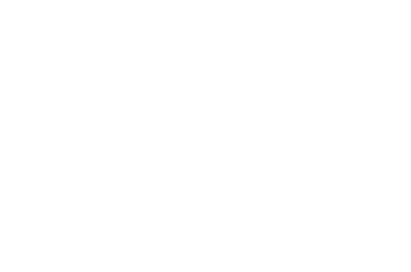
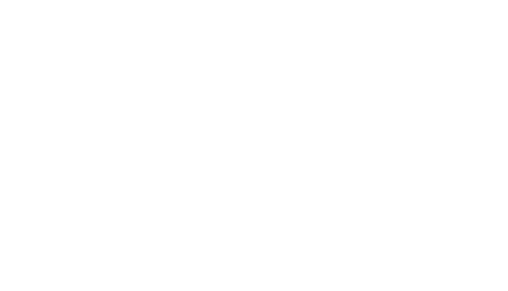
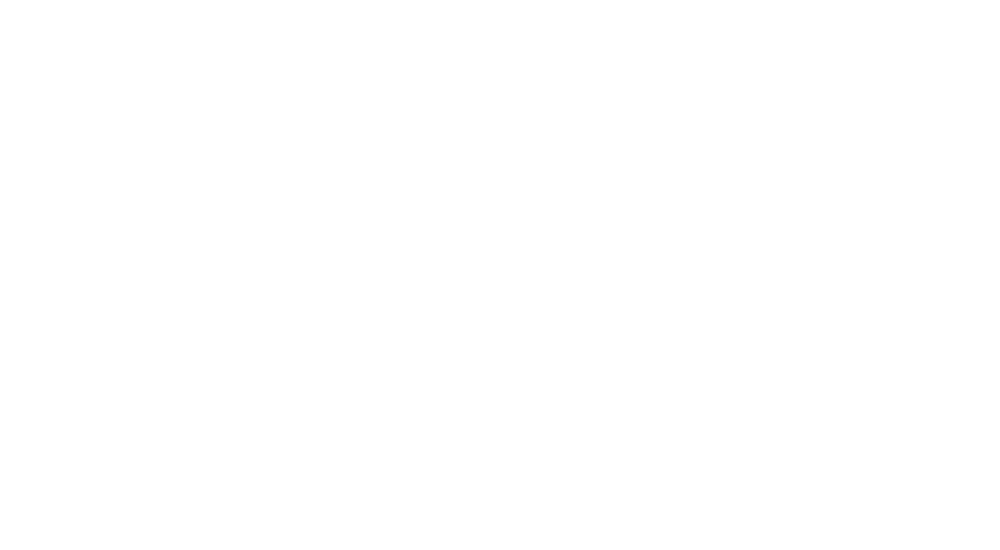

# Spirituality and Religion

In the world of role-playing games, it's important to consider the spirituality and religious beliefs of a character. The Spirituality Sheet is an integral part of character creation and is designed to help players define their character's connection to the spiritual and religious aspects of the game world. This chapter will detail the mechanics behind the Spirituality Sheet, including the options available for defining the strength of a character's belief or association with a religious system, as well as any relevant traits and skills that may impact the character's spirituality and religious beliefs. Whether playing as a devout follower of a particular faith or a non-believer, the Spirituality Sheet will help players bring their character to life and create a more immersive role-playing experience.

## Adherence

The "Adherence" field on the character sheet represents the strength of the character's belief or association with a particular religious or spiritual system. The options for this field range from non-believer to orthodox adherent, providing a spectrum of beliefs that a character can possess. The non-believer is someone who does not hold any belief in a higher power, whereas an agnostic is someone who is uncertain about the existence of a higher power. On the other hand, a casual adherent is someone who holds a loose connection to their religious or spiritual beliefs, and an orthodox adherent is someone who strictly follows the teachings and practices of their chosen system. This mechanic helps to further flesh out the character and their motivations, and provides a lens through which the character may view the world around them.

1.	Non-believer
2.	Agnostic
3.	Casual adherent
4.	Orthodox adherent

## Tolerance

This field reflects the character's willingness to accept differences of belief in others. In determining the level of tolerance, there are three options available for the player to choose from: Inclusive, Tolerant, or Intolerant. The level of tolerance selected will affect how the character interacts with people of different beliefs and religions in the game world.

1.	Inclusive
2.	Tolerant
3.	Intolerant

## Religious Demeanor

The field "RELIGIOUS DEMEANOR" on the character sheet aims to capture how your character tends to act in regards to religious beliefs. To reflect this, the player will be presented with three different fields to fill out. The first field is "Expression of beliefs" and asks the player to decide on the frequency at which their character expresses their beliefs. The options range from "None", "Occasional", to "Constant". The next field is "Converting others", which asks the player to choose the level of effort the character puts into converting others to their beliefs. The choices here are "Never", "Casual", and "Aggressive". Finally, the "Attitude" field asks the player to choose the general approach the character takes towards religion and religious beliefs. The options for this field range from the irreverent "Irreverent" to the devout "Ecstatic". By filling out these fields, the player can gain a deeper understanding of their character's relationship to religion and spirituality.

| Expression of beliefs | Converting others | Attitude     |
|-----------------------|-------------------|--------------|
| - None                | - Never           | - Irreverent |
| - Occasional          | - Casual          | - Fearful    |
| - Constant            | - Aggressive      | - Judgmental |
|                       |                   | - Humble     |
|                       |                   | - Ecstatic   |

## Religious association

The "Religious Association" field in the character sheet is an important aspect of a character's spirituality. This field indicates the character's affiliation, or lack thereof, with a religious organization or belief system. There are a range of options available, including Church, Cult, Fellowship, Solitary, and Indigenous, each with its own unique meaning and characteristics.

A Church is a well-established, hierarchical religious organization, typically with a set of beliefs and practices that are followed by its members. A Cult is a smaller group attached to a single charismatic leader, who may have unique or unconventional beliefs. A Fellowship is a small, informal religious group that lacks formal organization and a charismatic leader. Solitary is for characters who either have unique beliefs or choose not to affiliate with others, and Indigenous refers to religious traditions within a cultural group, such as a family or village.

Having an understanding of a character's religious association can provide insight into their beliefs, values, and motivations, and can also add depth to their relationships with other characters. This field can also play a role in the story, as it may impact the character's actions and decisions, as well as influence how they are perceived by others.

| Term           | Definition                                                                                                                                         |
|----------------|----------------------------------------------------------------------------------------------------------------------------------------------------|
| Church         | A large, established, and hierarchical religious organization with a set of doctrines and practices.                                               |
| Cult           | A small or large group with a strong devotion to a single charismatic leader, often with unconventional beliefs and practices.                     |
| Fellowship     | A small group of like-minded individuals who gather for religious purposes, but lack formal organization and a charismatic leader.                 |
| Solitary       | A character who holds unique beliefs or has chosen not to affiliate with any religious group.                                                      |
| Indigenous     | Religious traditions within a cultural group, such as a family, village, or tribe, with a strong connection to their cultural identity.            |
| Sect           | A subgroup within a larger religious organization that holds distinct beliefs and practices.                                                       |
| Coven          | A group of individuals who practice witchcraft, often with elements of nature worship and animism.                                                 |
| Temple         | A place of worship associated with a specific religion or spiritual tradition.                                                                     |
| Monastery      | A religious community, often associated with a specific order or denomination, known for their dedication to a life of contemplation and devotion. |
| Mystic Order   | A secret society or organization dedicated to the study and practice of spiritual and esoteric knowledge.                                          |

## Religious Roles

The "Religious Roles" field represents the various positions and titles within a fictional religious organization or belief system. These roles range from leaders and spiritual advisors, to assistants and messengers, to protectors and mediators. Each role comes with its own set of responsibilities and privileges, reflecting the unique aspects and beliefs of the religion it represents. Some religious roles may be highly respected and hold significant power within the community, while others may be more solitary or focused on specific tasks. This field is important for creating well-rounded and diverse religious systems within the game world, and for providing players with the opportunity to explore different aspects of spirituality and faith. Whether a player chooses to play a charismatic leader or a solitary mystic, the "Religious Roles" field offers a wealth of opportunities for role-playing and character development.

| Role              | Description                                                                                         |
|-------------------|-----------------------------------------------------------------------------------------------------|
| Abbot/Abbess      | The leader of a monastery or convent.                                                               |
| Archbishop        | A bishop who oversees multiple dioceses.                                                            |
| Acolyte           | An assistant or beginner in religious service.                                                      |
| Bishop            | An overseer of a specific area or diocese within a church.                                          |
| Chaplain          | A spiritual advisor in a specific setting, such as a hospital or military unit.                     |
| Cult Leader       | Usually a charismatic head of a small group of highly devoted followers.                            |
| Disciple          | A dedicated follower of a religious teacher or leader.                                               |
| Elder             | An experienced and respected member of a religious community.                                       |
| Evangelist        | A religious figure who spreads the gospel or message of their faith to others.                      |
| Guru              | A spiritual teacher.                                                                                |
| Inquisitor        | An official tasked with finding and "correcting" people who have broken religious rules.            |
| Martyr            | A person who dies for their religious beliefs.                                                      |
| Missionary        | Dedicated to converting others, usually in distant geographic areas.                                |
| Monk/Nun          | Belongs to a monastery or convent.                                                                  |
| Mystic            | A person who has direct experience of ultimate reality through spiritual or mystical practices.     |
| Patriarch/Matriarch | The leader of an organized religion.                                                               |
| Pilgrim           | One traveling to a holy site or landmark.                                                           |
| Priest/Priestess  | Someone authorized to administer sacraments as an ordained member of a church.                       |
| Prophet           | One inspired to utter revelations or predictions, often in service to a deity.                      |
| Reverend          | An honorific title given to a religious figure.                                                     |
| Sacred Courtesan  | Has sex, often with strangers, in service to a religion and for a symbolic price.                   |
| Mediator          | A person who helps resolve conflicts and bring people together through spiritual means.             |
| Seeker            | One who is searching for spiritual knowledge and understanding.                                     |
| Temple Guardian   | A protector of a religious site, such as a temple or shrine.                                        |
| Wandering Monk    | A roving spiritual teacher who travels from place to place, spreading religious teachings.           |
| Witch             | A practitioner of magic who uses their powers for spiritual purposes.                               |
| Healer            | A person skilled in the use of herbs, prayers, or other methods to cure illnesses and injuries.     |
| Oracle            | A person or entity that provides insight or prophesies into the future or hidden knowledge.         |
| Seer              | A person who has the ability to see and understand things that others cannot, often through spiritual means. |
| Divine Herald     | A messenger of the gods, responsible for delivering messages and performing sacred duties.          |
| Sanctuary Keeper  | The caretaker of a sacred place, responsible for maintaining its sanctity and protecting it.         |
| Temple Guardian   | A protector of a religious site, such as a temple or shrine.                                        |
| Shrine Maiden     | A female spiritual attendant, responsible for maintaining the purity and sanctity of a shrine.      |
| Ritualist         | A person skilled in the performance of religious rituals and ceremonies.                            |
| Visionary         | A person who receives and interprets divine visions and messages.                                   |
| Soothsayer        | A person who predicts future events based on astrology, dreams, or other forms of divination.       |
| Holy Knight       | A warrior who serves a religious cause and protects the faithful.                                   |
| Chant Master      | A person who leads religious music and song, often in a religious setting.                          |
| Deacon            | A clergy member responsible for serving the needs of a congregation.                                |
| Minister          | A religious leader who serves a specific denomination or congregation.                              |
| Deity             | A supernatural being worshipped as having power over the world and human affairs.                   |
| Saint             | A person recognized as holy or virtuous by a particular religion.                                   |
| Apostle           | A messenger or disciple of a religious teacher or leader.                                           |
| Recluse           | One who lives in solitude for spiritual or religious reasons.                                       |
| Necromancer       | A person who communicates with the dead for the purpose of gaining knowledge or guidance.           |

## Practices/Rituals:

The "Practices/Rituals" field is an important aspect of a character's spiritual profile, as it allows players to flesh out their character's religious beliefs and observances. This field covers the specific rituals or practices that the character engages in, such as daily prayers or meditations, monthly celebrations or ceremonies, seasonal rituals, or life milestones. In addition to the type of ritual, this field may also include information on the frequency, location, and details of the ritual itself. For example, a character might participate in a monthly full moon ritual that involves offering incense, reciting prayers, and communing with their deity or spirit guide. By including this information, players can help to create a more vivid and immersive representation of their character's spirituality. Additionally, this information can also be used to drive roleplaying decisions, such as the character's reactions to certain situations or interactions with others. Overall, the "Practices/Rituals" field is a valuable tool for creating well-rounded, believable characters with unique spiritual perspectives.

**Daily prayers or meditations:**

- This entry would describe any daily spiritual practices the character engages in, such as daily prayers, meditations, or affirmations. The player could specify the frequency, duration, and location of these activities, as well as the purpose or intention behind them.

**Monthly religious celebrations or ceremonies:**

- This entry would describe any monthly religious events or observances the character participates in, such as full moon rituals, holy days, or feast days. The player could detail the specific celebrations or ceremonies, the significance or meaning behind them, and the role the character plays in these events.

**Seasonal rituals or observances:**

- This entry would describe any seasonal spiritual practices or events the character participates in, such as solstice or equinox ceremonies, harvest festivals, or other events that mark the changing of the seasons. The player could detail the specific rituals or observances, the significance or meaning behind them, and the role the character plays in these events.

**Life milestones or rites of passage:**

- This entry would describe any spiritual practices or events that mark important transitions or milestones in the character's life, such as birth, adolescence, marriage, or death. The player could detail the specific rituals or observances, the significance or meaning behind them, and the role the character plays in these events.

**Fasting or dietary restrictions:**

- This entry would describe any dietary restrictions or fasting practices the character engages in for religious or spiritual reasons. The player could specify the type of fasting, the frequency, and the reason behind it, as well as any specific dietary restrictions the character follows, such as vegetarianism or prohibitions against certain foods or ingredients.

**Pilgrimages or sacred journeys:**

- This entry would describe any pilgrimages or sacred journeys the character has taken or plans to take, such as visiting holy sites, participating in spiritual retreats, or making offerings at shrines or temples. The player could detail the specific destinations, the significance or meaning behind these journeys, and any preparations or rituals involved in making these trips.

**Animal or human sacrifices:**

- This entry would describe any instances where the character participates in or witnesses animal or human sacrifices as part of their religious or spiritual beliefs. The player could detail the specific reasons for these sacrifices, the religious or spiritual significance behind them, and any emotional or ethical conflicts the character experiences in relation to these practices.

**Chanting, Singing, or Dancing:**

- These rituals often involve repetitive vocalizations or movements that are meant to connect the individual with the divine or the spiritual realm. In some religions, singing and dancing are also used to tell religious stories or to give praise to a deity. These practices can be performed individually or as part of a group, and they can take place in a designated religious space or in everyday life.

**Use of Religious Symbols or Artifacts:**

- Religious symbols and artifacts can hold a significant spiritual meaning for an individual and can be used in religious practices and rituals. They may include objects such as crosses, statues, altars, prayer beads, or other items that are used to focus the individual's thoughts and emotions towards their religion. The use of these symbols and artifacts may also serve as a way to connect the individual with the divine, to protect themselves from harm, or to mark special moments in their spiritual journey.

**Spiritual or Physical Purification Rituals:**

- Purification rituals can take many forms and serve different purposes, but they typically aim to cleanse the individual of negative energies or influences. These rituals may involve washing or bathing, fasting, meditation, or the use of special incense or herbs. In some cultures, spiritual purification may be seen as a necessary step before engaging in other religious practices or before coming into contact with sacred spaces or objects.

**Offering of Incense or Candles:**

- The burning of incense or candles is a common religious practice in many cultures and can serve a variety of purposes. It may be used to create a peaceful or meditative atmosphere, to communicate with the divine, to make offerings to a deity, or to symbolize the individual's devotion. The act of lighting incense or candles may also involve specific rituals or prayers, making the act of offering a spiritual or sacred act.

**Recitation of Prayers, Mantras, or Affirmations:**

- The recitation of prayers, mantras, or affirmations is a common practice in many religions and spiritual traditions. These verbal expressions can serve as a way to connect with the divine, to focus the individual's thoughts, or to give praise or gratitude. Prayers and mantras may be recited individually or in a group, and they may involve specific actions such as bowing, kneeling, or making offerings.

**Meditation or Visualization Exercises:**

- Meditation and visualization exercises are commonly used in spiritual and religious contexts as a way to focus the mind and connect with the divine. These practices can involve focusing on a specific image or thought, repeating a mantra or affirmation, or simply letting the mind become still. Meditation and visualization can be performed in a quiet or sacred space, or as part of a larger ritual or ceremony.

**Communication with Gods, Spirits, or Ancestors:**

- Many spiritual and religious traditions involve communicating with gods, spirits, or ancestors as a way to seek guidance, protection, or to make offerings. This communication can take many forms, including prayer, divination, or mediumship. In some cultures, communication with the spiritual realm is seen as a necessary part of daily life, while in others it is reserved for special occasions or life events.

**Divination or prophetic rituals:**

- Divination or prophetic rituals involve seeking insight or knowledge of the future, or receiving guidance from a higher power. This could include practices like tarot readings, casting bones, or interpreting omens. These rituals are often performed by a designated individual within the religious community, such as a priest or shaman.

**Healing or protection rituals:**

- Healing or protection rituals are performed with the intention of restoring health or providing protection to an individual or community. These could include practices like laying on of hands, reciting incantations, or using magical symbols. These rituals may be performed by a religious leader or by individuals seeking to heal themselves or others.

**Rituals involving the use of psychoactive substances:**

- Rituals involving the use of psychoactive substances, such as entheogenic plants or psychedelics, are sometimes used in religious or spiritual practices. These substances are believed to alter the state of consciousness, allowing the individual to connect with the divine or access higher states of awareness. These practices are often performed under the guidance of a shaman or spiritual leader and are considered sacred within some religious traditions.

**Group meditation or prayer sessions:**

- Group meditation or prayer sessions involve a community of individuals coming together to meditate, pray, or perform other spiritual practices in unison. These sessions are often led by a religious leader or facilitator and may be performed on a regular basis, such as daily or weekly. Group meditation or prayer sessions can provide a sense of community and support for those involved and can also help to deepen individual spiritual experiences.

**Choral performances or religious music:**

- Choral performances or religious music involve singing or playing musical instruments in a religious or spiritual context. This could include hymns, chants, or gospel songs. These performances may be performed by a choir.

## Challenges to Faith
This field provides a platform for the player to delve into the complexities of their character's faith and beliefs. The challenges to faith can take various forms, each one presenting its own set of obstacles for the character to overcome. Through detailing these trials, the player can create a well-rounded religious background for their character, one that reflects the multifaceted nature of faith and belief in ancient times.

**Listed here are some examples of challenges to faith, such as:**

- Personal trial of faith
- Encounter with a conflicting faith tradition
- Questioning of core religious teachings
- Uncertainty in the existence of a divine power
- Loss of a cherished one who was a source of spiritual fortitude
- Disagreement with a religious leader or community
- Surviving a traumatic event
- Exposure to alternative creeds or doctrines
- Difficulty aligning religious beliefs with life experiences
- Lack of satisfaction or meaning in life
- Tribulation to personal morals and ethics
- Negative experiences with members of a religious group
- A shift in life circumstances or surroundings
- Discrepancies within religious doctrine or teachings
- Disillusionment with the actions of religious leaders or institutions
- Inability to experience a personal spiritual connection
- A change in personal values or goals
- A yearning for a deeper understanding of one's beliefs

## Conclusion

In conclusion, the Spirituality Sheet provides a comprehensive way to shape a character's religious and spiritual beliefs within the game world. By exploring the various aspects of adherence, tolerance, religious demeanor, association, roles, practices and rituals, as well as challenges to faith, players can craft a well-rounded and believable character that is truly reflective of their personal beliefs and experiences. The Spirituality Sheet is a valuable tool for bringing depth and dimension to a character and allowing players to fully immerse themselves in their role-playing experience. Whether your character is devout, questioning, or somewhere in between, the Spirituality Sheet provides the framework necessary to create a truly authentic and engaging character.

