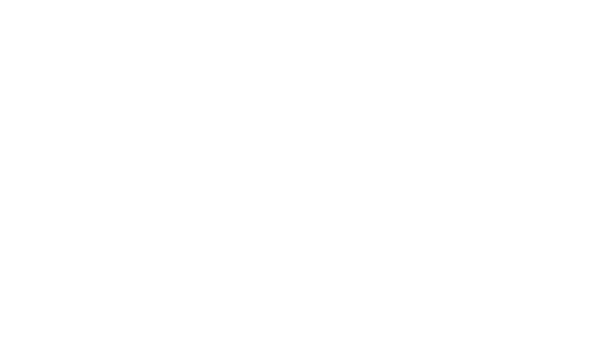

# Combat and Conflict Resolution

In Eidos, the combat is based on the ideas presented in this [video](https://www.youtube.com/watch?v=0o5vWmoS3KU&ab_channel=SimplyWyvern). Basicly the combat needs to be a part of the narrative, not a mini-game that creates transitions in the game. So there is nothing of  initiative rolls nor anything like that. In the world of Eidos, combat is a dynamic and immersive experience that forms an integral part of the gameplay. Rooted in the principles of open-source development and designed to offer a deep narrative experience driven by player choice, Eidos sets itself apart as a unique addition to the tabletop role-playing genre. The combat system in Eidos is meticulously crafted to simulate realistic combat scenarios, with mechanics that emphasize tactical decision-making and narrative engagement.

## Turn Structure

Combat in Eidos follows a fluid turn structure, allowing for seamless interaction between players and the game master. Unlike traditional turn-based systems, Eidos prioritizes moment-to-moment decision-making, where players and the GM exchange actions and reactions in real-time. This approach enhances the narrative flow of combat scenes, fostering a sense of urgency and immersion.

## Conflic Resolution

Conflict resolution in Eidos is resolved through a combination of dice rolls and narrative storytelling. Players utilize a 2 20d roll to determine the outcome of their actions, with results influenced by their character's skills, abilities, and environmental factors. The DM adjudicates conflicts based on the narrative context, ensuring that combat encounters remain dynamic and unpredictable. 

| Difficulty        | Target Number |
|-------------------|---------------|
| Very easy         | 05            |
| Easy              | 10            |
| Moderate          | 15            |
| Difficult         | 20            |
| Hard              | 25            |
| Very hard         | 30            |
| Extremely hard    | 35            |
| Nearly impossible | 39            |

## Injury Tables

Each attack's success prompts a roll on a corresponding injury table. For example, an attacker aims for a specific body part like the neck and successfully hits, the player rolls the "Cutting in Neck Damage Table" to determine the outcome. These tables define the consequences, ranging from minor wounds to severe trauma.

| Type of Damage | Description                                   |
|----------------|-----------------------------------------------|
| Cutting        | Damage caused by sharp-edged weapons          |
| Stabbing       | Damage caused by piercing weapons             |
| Impact         | Damage from blunt force or crushing attacks   |
| Fire           | Damage from burns or heat sources             |
| Acid           | Damage from corrosive acids or chemicals      |
| Poison         | Damage caused by poison                       |
| Fall           | Damage caused by falling from a tall place    |

| Body Part      | Description                                      |
|----------------|--------------------------------------------------|
| Head           | The uppermost part of the body                   |
| Torso          | The main part of the body, including chest       |
| Left Arm       | The left arm and hand                            |
| Right Arm      | The right arm and hand                           |
| Left Leg       | The left leg and foot                            |
| Right Leg      | The right leg and foot                           |
| Abdomen        | The area between the chest and pelvis            |
| Back           | The rear part of the torso                       | 
| Neck           | The part connecting the head to the body         |
| Face           | The front of the head, including facial features |

### Cutting

**Cutting in the Head**

| Roll | Injury Description                                  | Recovery Time   | Scars               |
|------|-----------------------------------------------------|-----------------|---------------------|
| 1    | Minor scalp laceration, blood trickling             | 1d4 hours       | Light scar          |
| 2    | Shallow cut on forehead, slight bleeding            | 1d4 hours       | Small scar          |
| 3    | Ear nicked, minor pain and bleeding                 | 1d4 hours       | Tiny scar           |
| 4    | Cheek grazed, minor discomfort                      | 1d4 hours       | Faint scar          |
| 5    | Eyebrow cut, minor blood and irritation             | 1d4 hours       | Light scar          |
| 6    | Nose scratched, slight bleeding                     | 1d4 hours       | Small scar          |
| 7    | Chin cut, stinging pain and minor blood             | 1d4 hours       | Tiny scar           |
| 8    | Forehead gash, bleeding and moderate pain           | 1d4 hours       | Faint scar          |
| 9    | Scalp tear, bleeding and headache                   | 1d4 hours       | Light scar          |
| 10   | Lip cut, bleeding and mild pain                     | 1d4 hours       | Small scar          |
| 11   | Deep facial wound, potential scarring               | 1d4 days        | Visible scar        |
| 12   | Eye injured, risk of blindness                      | 1d4 days        | Disfiguring scar    |
| 13   | Skull fracture, severe headache                     | 1d4 weeks       | Permanent damage    |
| 14   | Head gash, risk of infection                        | 1d4 weeks       | Deep scar           |
| 15   | Severed artery, immediate death                     | Instant death   | N/A                 |
| 16   | Severe brain injury, instant unconsciousness        | Instant death   | N/A                 |
| 17   | Instant brain death, no chance of revival           | Instant death   | N/A                 |
| 18   | Severe cranial trauma, instant death                | Instant death   | N/A                 |
| 19   | Critical hit, catastrophic brain damage             | Instant death   | N/A                 |
| 20   | Critical hit, brain pierced, instant death          | Instant death   | N/A                 |

**Cutting in the Torso**

| Roll | Injury Description                                      | Recovery Time   | Scars               |
|------|---------------------------------------------------------|-----------------|---------------------|
| 1    | Superficial chest graze, minor pain                     | 1d4 hours       | Faint scar          |
| 2    | Light abdominal scratch, discomfort                     | 1d4 hours       | Small scar          |
| 3    | Minor rib cut, mild pain and shallow bleeding           | 1d4 hours       | Tiny scar           |
| 4    | Skin nicked on side, slight irritation                  | 1d4 hours       | Faint scar          |
| 5    | Chest cut, moderate pain and minor bleeding             | 1d4 hours       | Light scar          |
| 6    | Abdominal laceration, blood trickling                   | 1d4 hours       | Small scar          |
| 7    | Side wound, moderate pain and bleeding                  | 1d4 hours       | Tiny scar           |
| 8    | Deep chest gash, significant bleeding                   | 1d4 days        | Faint scar          |
| 9    | Rib gash, severe pain and bleeding                      | 1d4 days        | Light scar          |
| 10   | Abdominal cut, potential scarring                       | 1d4 days        | Small scar          |
| 11   | Organ grazed, risk of infection                         | 1d4 weeks       | Deep scar           |
| 12   | Punctured lung, difficulty breathing                    | 1d4 weeks       | Permanent damage    |
| 13   | Severe internal injury, risk of shock                   | 1d4 weeks       | Visible scar        |
| 14   | Aorta nicked, rapid blood loss                          | Instant death   | N/A                 |
| 15   | Heart pierced, immediate death                          | Instant death   | N/A                 |
| 16   | Severed spinal cord, instant paralysis                  | Instant death   | N/A                 |
| 17   | Major organ rupture, instant internal bleeding          | Instant death   | N/A                 |
| 18   | Critical hit, catastrophic internal damage              | Instant death   | N/A                 |
| 19   | Critical hit, vital organs obliterated                  | Instant death   | N/A                 |
| 20   | Critical hit, torso sliced open, instant death          | Instant death   | N/A                 |

**Cutting in the Arms**

| Roll | Injury Description                                      | Recovery Time   | Scars               |
|------|---------------------------------------------------------|-----------------|---------------------|
| 1    | Superficial arm graze, minor discomfort                 | 1d4 hours       | Faint scar          |
| 2    | Light forearm scratch, slight pain                      | 1d4 hours       | Small scar          |
| 3    | Minor hand cut, mild bleeding                           | 1d4 hours       | Tiny scar           |
| 4    | Skin nicked on upper arm, slight irritation             | 1d4 hours       | Faint scar          |
| 5    | Elbow grazed, moderate pain and minor bleeding          | 1d4 hours       | Light scar          |
| 6    | Wrist scratched, slight bleeding                        | 1d4 hours       | Small scar          |
| 7    | Finger cut, stinging pain and minor bleeding            | 1d4 hours       | Tiny scar           |
| 8    | Deep forearm gash, significant bleeding                 | 1d4 days        | Faint scar          |
| 9    | Upper arm cut, severe pain and bleeding                 | 1d4 days        | Light scar          |
| 10   | Hand laceration, potential scarring                     | 1d4 days        | Small scar          |
| 11   | Tendon nicked, risk of permanent damage                 | 1d4 weeks       | Deep scar           |
| 12   | Arterial wound, rapid blood loss                        | Instant death   | N/A                 |
| 13   | Hand mutilation, high risk of infection                 | Instant death   | N/A                 |
| 14   | Severe muscle damage, limited use of arm                | 1d4 weeks       | Permanent damage    |
| 15   | Hand severed, instant death                             | Instant death   | N/A                 |
| 16   | Critical hit, arm sliced off, instant death             | Instant death   | N/A                 |
| 17   | Critical hit, arm mutilated, instant death              | Instant death   | N/A                 |
| 18   | Critical hit, arteries severed, instant death           | Instant death   | N/A                 |
| 19   | Critical hit, shattered bones, instant death            | Instant death   | N/A                 |
| 20   | Critical hit, arm disintegrated, instant death          | Instant death   | N/A                 |

**Cutting in the Legs**

| Roll | Injury Description                                       | Recovery Time   | Scars               |
|------|----------------------------------------------------------|-----------------|---------------------|
| 1    | Superficial thigh graze, minor discomfort                | 1d4 hours       | Faint scar          |
| 2    | Light calf scratch, slight pain                          | 1d4 hours       | Small scar          |
| 3    | Minor ankle cut, mild bleeding                           | 1d4 hours       | Tiny scar           |
| 4    | Skin nicked on shin, slight irritation                   | 1d4 hours       | Faint scar          |
| 5    | Knee grazed, moderate pain and minor bleeding            | 1d4 hours       | Light scar          |
| 6    | Heel scratched, slight bleeding                          | 1d4 hours       | Small scar          |
| 7    | Toe cut, stinging pain and minor bleeding                | 1d4 hours       | Tiny scar           |
| 8    | Deep thigh gash, significant bleeding                    | 1d4 days        | Faint scar          |
| 9    | Calf cut, severe pain and bleeding                       | 1d4 days        | Light scar          |
| 10   | Ankle laceration, potential scarring                     | 1d4 days        | Small scar          |
| 11   | Tendon severed, risk of permanent damage                 | 1d4 weeks       | Deep scar           |
| 12   | Arterial wound, rapid blood loss                         | Instant death   | N/A                 |
| 13   | Leg mutilation, high risk of infection                   | Instant death   | N/A                 |
| 14   | Severe muscle damage, limited mobility                   | 1d4 weeks       | Permanent damage    |
| 15   | Leg severed, instant death                               | Instant death   | N/A                 |
| 16   | Critical hit, leg sliced off, instant death              | Instant death   | N/A                 |
| 17   | Critical hit, leg mutilated, instant death               | Instant death   | N/A                 |
| 18   | Critical hit, arteries severed, instant death            | Instant death   | N/A                 |
| 19   | Critical hit, shattered bones, instant death             | Instant death   | N/A                 |
| 20   | Critical hit, leg disintegrated, instant death           | Instant death   | N/A                 |

**Cutting in the Abdomen**

| Roll | Injury Description                                    | Recovery Time   | Scars               |
|------|-------------------------------------------------------|-----------------|---------------------|
| 1    | Superficial scratch, minor discomfort                 | 1d4 hours       | Light scar          |
| 2    | Shallow cut, light bleeding and mild pain             | 1d4 hours       | Small scar          |
| 3    | Glancing blow, minimal bleeding                       | 1d4 hours       | Tiny scar           |
| 4    | Skin nicked, slight pain and minor bleeding           | 1d4 hours       | Faint scar          |
| 5    | Grazed wound, bleeding and moderate pain              | 1d4 hours       | Light scar          |
| 6    | Sliced flesh, steady bleeding and discomfort          | 1d4 hours       | Small scar          |
| 7    | Deep cut, significant pain and bleeding               | 1d4 hours       | Tiny scar           |
| 8    | Muscle incision, bleeding and throbbing pain          | 1d4 hours       | Faint scar          |
| 9    | Torn flesh, profuse bleeding and severe pain          | 1d4 days        | Light scar          |
| 10   | Severe laceration, risk of infection and agony        | 1d4 days        | Small scar          |
| 11   | Ruptured muscle, intense pain and internal bleeding   | 1d4 days        | Visible scar        |
| 12   | Organ grazed, danger of internal complications        | 1d4 weeks       | Deep scar           |
| 13   | Severed artery, rapid blood loss and shock            | 1d4 weeks       | Permanent damage    |
| 14   | Major organ damage, critical condition                | 1d4 weeks       | Life-altering scar  |
| 15   | Perforated intestine, septicemia and extreme pain     | Instant death   | N/A                 |
| 16   | Ruptured kidney, internal hemorrhage and shock        | Instant death   | N/A                 |
| 17   | Impaled aorta, rapid exsanguination and agony         | Instant death   | N/A                 |
| 18   | Critical hit, disembowelment and instant death        | Instant death   | N/A                 |
| 19   | Critical hit, evisceration and instant death          | Instant death   | N/A                 |
| 20   | Critical hit, shredded organs and instant death       | Instant death   | N/A                 |

**Cutting in the Back**

| Roll | Injury Description                                      | Recovery Time   | Scars               |
|------|---------------------------------------------------------|-----------------|---------------------|
| 1    | Superficial scratch, minor discomfort                   | 1d4 hours       | Light scar          |
| 2    | Shallow cut, light bleeding and mild pain               | 1d4 hours       | Small scar          |
| 3    | Skin grazed, slight pain and minor bleeding             | 1d4 hours       | Tiny scar           |
| 4    | Flesh nicked, minor discomfort                          | 1d4 hours       | Faint scar          |
| 5    | Surface cut, bleeding and moderate pain                 | 1d4 hours       | Light scar          |
| 6    | Muscle graze, slight bleeding and irritation            | 1d4 hours       | Small scar          |
| 7    | Deep cut, significant pain and bleeding                 | 1d4 hours       | Tiny scar           |
| 8    | Tendon nicked, bleeding and throbbing pain              | 1d4 hours       | Faint scar          |
| 9    | Muscle laceration, bleeding and discomfort              | 1d4 days        | Light scar          |
| 10   | Nerve cut, risk of partial paralysis and agony          | 1d4 days        | Small scar          |
| 11   | Ruptured muscle, intense pain and internal bleeding     | 1d4 days        | Visible scar        |
| 12   | Organ grazed, potential internal complications          | 1d4 weeks       | Deep scar           |
| 13   | Major artery cut, rapid blood loss and shock            | 1d4 weeks       | Permanent damage    |
| 14   | Spinal injury, paralysis risk and extreme pain          | 1d4 weeks       | Life-altering scar  |
| 15   | Severed spine, instant paralysis and agony              | Instant death   | N/A                 |
| 16   | Critical hit, spine shattered, instant death            | Instant death   | N/A                 |
| 17   | Critical hit, spine pierced, instant death              | Instant death   | N/A                 |
| 18   | Critical hit, vital organ pierced, instant death        | Instant death   | N/A                 |
| 19   | Critical hit, disembowelment and instant death          | Instant death   | N/A                 |
| 20   | Critical hit, catastrophic spinal trauma and death      | Instant death   | N/A                 |

**Cutting in the Neck**

| Roll | Injury Description                                | Recovery Time   | Scars               |
|------|---------------------------------------------------|-----------------|---------------------|
| 1    | Skin nick, minor discomfort                       | 1d4 hours       | Light scar          |
| 2    | Shallow cut, light bleeding and mild pain         | 1d4 hours       | Small scar          |
| 3    | Neck graze, slight pain and minor bleeding        | 1d4 hours       | Tiny scar           |
| 4    | Flesh cut, minor discomfort                       | 1d4 hours       | Faint scar          |
| 5    | Surface wound, bleeding and moderate pain         | 1d4 hours       | Light scar          |
| 6    | Muscle nick, slight bleeding and irritation       | 1d4 hours       | Small scar          |
| 7    | Deep gash, significant pain and bleeding          | 1d4 hours       | Tiny scar           |
| 8    | Carotid artery cut, rapid blood loss              | Instant death   | N/A                 |
| 9    | Jugular vein cut, severe blood loss               | Instant death   | N/A                 |
| 10   | Windpipe nick, difficulty breathing               | 1d4 days        | Light scar          |
| 11   | Nerve damage, risk of partial paralysis           | 1d4 days        | Small scar          |
| 12   | Critical hit, trachea crushed, instant death      | Instant death   | N/A                 |
| 13   | Critical hit, spinal cord severed, death          | Instant death   | N/A                 |
| 14   | Critical hit, catastrophic blood loss             | Instant death   | N/A                 |
| 15   | Critical hit, catastrophic muscle damage          | Instant death   | N/A                 |
| 16   | Critical hit, major artery cut, instant death     | Instant death   | N/A                 |
| 17   | Critical hit, dissection of vital organs          | Instant death   | N/A                 |
| 18   | Critical hit, decapitation, instant death         | Instant death   | N/A                 |
| 19   | Critical hit, mutilation, instant death           | Instant death   | N/A                 |
| 20   | Critical hit, neck shattered, instant death       | Instant death   | N/A                 |

**Cutting in the Face**

| Roll | Injury Description                                 | Recovery Time   | Scars               |
|------|----------------------------------------------------|-----------------|---------------------|
| 1    | Superficial scratch, minor discomfort              | 1d4 hours       | Light scar          |
| 2    | Shallow cut, light bleeding and mild pain          | 1d4 hours       | Small scar          |
| 3    | Skin grazed, slight pain and minor bleeding        | 1d4 hours       | Tiny scar           |
| 4    | Cheek cut, minor discomfort                        | 1d4 hours       | Faint scar          |
| 5    | Eyebrow nick, minor blood and irritation           | 1d4 hours       | Light scar          |
| 6    | Nose scratch, slight bleeding                      | 1d4 hours       | Small scar          |
| 7    | Lip gash, stinging pain and minor bleeding         | 1d4 hours       | Tiny scar           |
| 8    | Forehead wound, bleeding and moderate pain         | 1d4 hours       | Faint scar          |
| 9    | Eye injury, risk of blindness                      | 1d4 days        | Disfiguring scar    |
| 10   | Deep facial wound, potential scarring              | 1d4 days        | Visible scar        |
| 11   | Facial nerve damage, risk of paralysis             | 1d4 days        | Permanent damage    |
| 12   | Critical hit, eye socket shattered, death          | Instant death   | N/A                 |
| 13   | Critical hit, facial bones crushed, death          | Instant death   | N/A                 |
| 14   | Critical hit, disfigurement, death                 | Instant death   | N/A                 |
| 15   | Critical hit, brain exposed, instant death         | Instant death   | N/A                 |
| 16   | Critical hit, catastrophic facial trauma           | Instant death   | N/A                 |
| 17   | Critical hit, mutilation, instant death            | Instant death   | N/A                 |
| 18   | Critical hit, jaw disintegration, instant death    | Instant death   | N/A                 |
| 19   | Critical hit, facial dismemberment, instant death  | Instant death   | N/A                 |
| 20   | Critical hit, head severed, instant death          | Instant death   | N/A                 |

### Stabbing

**Stabbing in the Head**

| Roll | Injury Description                                  | Recovery Time   | Scars               |
|------|-----------------------------------------------------|-----------------|---------------------|
| 1    | Grazed scalp, minor pain                            | 1d4 hours       | Light scar          |
| 2    | Superficial forehead stab, slight bleeding          | 1d4 hours       | Small scar          |
| 3    | Ear nicked, minor pain and bleeding                 | 1d4 hours       | Tiny scar           |
| 4    | Cheek stab, minor discomfort                        | 1d4 hours       | Faint scar          |
| 5    | Eyebrow pierced, minor blood and irritation         | 1d4 hours       | Light scar          |
| 6    | Nose scratched, slight bleeding                     | 1d4 hours       | Small scar          |
| 7    | Jaw hit, stinging pain and minor blood              | 1d4 hours       | Tiny scar           |
| 8    | Forehead stab, bleeding and moderate pain           | 1d4 hours       | Faint scar          |
| 9    | Scalp puncture, bleeding and headache               | 1d4 hours       | Light scar          |
| 10   | Lip puncture, bleeding and mild pain                | 1d4 hours       | Small scar          |
| 11   | Eye injured, risk of blindness                      | 1d4 days        | Disfiguring scar    |
| 12   | Critical hit, eye socket impaled, instant death     | Instant death   | N/A                 |
| 13   | Critical hit, brain impaled, instant death          | Instant death   | N/A                 |
| 14   | Critical hit, cranial fracture, instant death       | Instant death   | N/A                 |
| 15   | Critical hit, brain penetration, instant death      | Instant death   | N/A                 |
| 16   | Critical hit, catastrophic brain damage             | Instant death   | N/A                 |
| 17   | Critical hit, skull shattered, instant death        | Instant death   | N/A                 |
| 18   | Critical hit, brain dissection, instant death       | Instant death   | N/A                 |
| 19   | Critical hit, cerebral rupture, instant death       | Instant death   | N/A                 |
| 20   | Critical hit, decapitation, instant death           | Instant death   | N/A                 |

**Stabbing in the Torso**

| Roll | Injury Description                                   | Recovery Time    | Scars                |
|------|------------------------------------------------------|------------------|----------------------|
| 1    | Superficial abdominal graze, minor discomfort        | 1d4 hours        | Light scar           |
| 2    | Shallow chest cut, slight bleeding                   | 1d4 hours        | Small scar           |
| 3    | Rib nicked, minor pain and bleeding                  | 1d4 hours        | Tiny scar            |
| 4    | Belly graze, minor pain and irritation               | 1d4 hours        | Faint scar           |
| 5    | Abdominal cut, minor bleeding and discomfort         | 1d4 hours        | Light scar           |
| 6    | Diaphragm scratch, slight bleeding                   | 1d4 hours        | Small scar           |
| 7    | Lower abdomen stab, stinging pain and blood          | 1d4 hours        | Tiny scar            |
| 8    | Chest puncture, moderate pain and bleeding           | 1d4 hours        | Faint scar           |
| 9    | Gut wound, bleeding and abdominal pain               | 1d4 hours        | Light scar           |
| 10   | Side stab, bleeding and moderate pain                | 1d4 hours        | Small scar           |
| 11   | Lung punctured, breathing difficulties               | 1d4 days         | Visible scar         |
| 12   | Liver injury, internal bleeding risk                 | 1d4 days         | Disfiguring scar     |
| 13   | Critical hit, heart pierced, instant death           | Instant death    | N/A                  |
| 14   | Critical hit, major organ damage, instant death      | Instant death    | N/A                  |
| 15   | Critical hit, arterial rupture, instant death        | Instant death    | N/A                  |
| 16   | Critical hit, spine punctured, instant death         | Instant death    | N/A                  |
| 17   | Critical hit, disembowelment, instant death          | Instant death    | N/A                  |
| 18   | Critical hit, massive hemorrhage, instant death      | Instant death    | N/A                  |
| 19   | Critical hit, vital artery sliced, instant death     | Instant death    | N/A                  |
| 20   | Critical hit, impaled through heart, instant death   | Instant death    | N/A                  |

**Stabbing in the Arms**

| Roll | Injury Description                                 | Recovery Time   | Scars               |
|------|----------------------------------------------------|-----------------|---------------------|
| 1    | Superficial arm graze, minor discomfort            | 1d4 hours       | Light scar          |
| 2    | Shallow cut on forearm, slight bleeding            | 1d4 hours       | Small scar          |
| 3    | Arm nicked, minor pain and bleeding                | 1d4 hours       | Tiny scar           |
| 4    | Elbow grazed, minor pain and irritation            | 1d4 hours       | Faint scar          |
| 5    | Wrist cut, minor bleeding and discomfort           | 1d4 hours       | Light scar          |
| 6    | Knuckle scratched, slight bleeding                 | 1d4 hours       | Small scar          |
| 7    | Palm cut, stinging pain and minor blood            | 1d4 hours       | Tiny scar           |
| 8    | Forearm gash, moderate pain and bleeding           | 1d4 hours       | Faint scar          |
| 9    | Bicep tear, bleeding and muscle ache               | 1d4 hours       | Light scar          |
| 10   | Shoulder cut, bleeding and discomfort              | 1d4 hours       | Small scar          |
| 11   | Major artery nicked, immediate medical aid         | 1d4 days        | Visible scar        |
| 12   | Severe nerve damage, loss of sensation             | 1d4 days        | Disfiguring scar    |
| 13   | Critical hit, artery severed, instant death        | Instant death   | N/A                 |
| 14   | Critical hit, nerve cluster damaged                | Instant death   | N/A                 |
| 15   | Critical hit, major blood loss, instant death      | Instant death   | N/A                 |
| 16   | Critical hit, limb paralyzed, instant death        | Instant death   | N/A                 |
| 17   | Critical hit, shattered bone, instant death        | Instant death   | N/A                 |
| 18   | Critical hit, limb dismembered, instant death      | Instant death   | N/A                 |
| 19   | Critical hit, vital artery pierced, instant death  | Instant death   | N/A                 |
| 20   | Critical hit, arm impaled, instant death           | Instant death   | N/A                 |

**Stabbing in the Legs**

| Roll | Injury Description                                 | Recovery Time   | Scars               |
|------|----------------------------------------------------|-----------------|---------------------|
| 1    | Leg scratch, minor discomfort                      | 1d4 hours       | Light scar          |
| 2    | Calf graze, slight bleeding                        | 1d4 hours       | Small scar          |
| 3    | Ankle nicked, minor pain and bleeding              | 1d4 hours       | Tiny scar           |
| 4    | Knee scraped, minor pain and irritation            | 1d4 hours       | Faint scar          |
| 5    | Shin cut, minor bleeding and discomfort            | 1d4 hours       | Light scar          |
| 6    | Thigh scratched, slight bleeding                   | 1d4 hours       | Small scar          |
| 7    | Foot cut, stinging pain and minor blood            | 1d4 hours       | Tiny scar           |
| 8    | Upper leg gash, moderate pain and bleeding         | 1d4 hours       | Faint scar          |
| 9    | Hamstring tear, bleeding and muscle ache           | 1d4 hours       | Light scar          |
| 10   | Groin cut, bleeding and discomfort                 | 1d4 hours       | Small scar          |
| 11   | Major vein nicked, immediate medical aid           | 1d4 days        | Visible scar        |
| 12   | Severe nerve damage, impaired mobility             | 1d4 days        | Disfiguring scar    |
| 13   | Critical hit, artery severed, instant death        | Instant death   | N/A                 |
| 14   | Critical hit, major nerve damaged                  | Instant death   | N/A                 |
| 15   | Critical hit, massive blood loss, instant death    | Instant death   | N/A                 |
| 16   | Critical hit, leg paralyzed, instant death         | Instant death   | N/A                 |
| 17   | Critical hit, shattered bone, instant death        | Instant death   | N/A                 |
| 18   | Critical hit, leg dismembered, instant death       | Instant death   | N/A                 |
| 19   | Critical hit, vital artery pierced, instant death  | Instant death   | N/A                 |
| 20   | Critical hit, leg impaled, instant death           | Instant death   | N/A                 |

**Stabbing in The Abdomen**

| Roll | Injury Description                                    | Recovery Time   | Scars               |
|------|-------------------------------------------------------|-----------------|---------------------|
| 1    | Minor abdominal scratch, slight discomfort            | 1d4 hours       | Light scar          |
| 2    | Belly skin nicked, mild bleeding                      | 1d4 hours       | Small scar          |
| 3    | Navel area cut, minor pain and bleeding               | 1d4 hours       | Tiny scar           |
| 4    | Side grazed, minor pain and discomfort                | 1d4 hours       | Faint scar          |
| 5    | Lower abdomen cut, minor bleeding and irritation      | 1d4 hours       | Light scar          |
| 6    | Hip scratched, slight bleeding                        | 1d4 hours       | Small scar          |
| 7    | Waistline cut, stinging pain and minor blood          | 1d4 hours       | Tiny scar           |
| 8    | Upper abdomen wound, moderate pain and bleeding       | 1d4 hours       | Faint scar          |
| 9    | Deep abdominal laceration, internal discomfort        | 1d4 hours       | Light scar          |
| 10   | Flank cut, bleeding and mild pain                     | 1d4 hours       | Small scar          |
| 11   | Internal bleeding, urgent medical aid needed          | 1d4 days        | Visible scar        |
| 12   | Peritonitis risk, prolonged medical attention         | 1d4 days        | Disfiguring scar    |
| 13   | Critical hit, major organ punctured                   | Instant death   | N/A                 |
| 14   | Critical hit, vital artery slashed                    | Instant death   | N/A                 |
| 15   | Critical hit, massive internal bleeding               | Instant death   | N/A                 |
| 16   | Critical hit, organ rupture, instant death            | Instant death   | N/A                 |
| 17   | Critical hit, disembowelment, instant death           | Instant death   | N/A                 |
| 18   | Critical hit, abdominal explosion, instant death      | Instant death   | N/A                 |
| 19   | Critical hit, instant organ failure, instant death    | Instant death   | N/A                 |
| 20   | Critical hit, internal organs impaled, instant death  | Instant death   | N/A                 |

**Stabbing in the Back**

| Roll | Injury Description                                    | Recovery Time   | Scars               |
|------|-------------------------------------------------------|-----------------|---------------------|
| 1    | Superficial back scratch, minor discomfort            | 1d4 hours       | Light scar          |
| 2    | Back skin nicked, slight bleeding                     | 1d4 hours       | Small scar          |
| 3    | Shoulder grazed, minor pain and irritation            | 1d4 hours       | Tiny scar           |
| 4    | Lower back scratch, minor pain and discomfort         | 1d4 hours       | Faint scar          |
| 5    | Spinal area cut, minor bleeding and irritation        | 1d4 hours       | Light scar          |
| 6    | Upper back scratch, slight bleeding                   | 1d4 hours       | Small scar          |
| 7    | Mid-back cut, stinging pain and minor blood           | 1d4 hours       | Tiny scar           |
| 8    | Deep back wound, moderate pain and bleeding           | 1d4 hours       | Faint scar          |
| 9    | Punctured lung, labored breathing                     | 1d4 hours       | Light scar          |
| 10   | Kidney area cut, bleeding and mild pain               | 1d4 hours       | Small scar          |
| 11   | Severed spine, instant paralysis                      | Instant death   | N/A                 |
| 12   | Critical hit, major organ damage                      | Instant death   | N/A                 |
| 13   | Critical hit, spinal cord severed                     | Instant death   | N/A                 |
| 14   | Critical hit, internal bleeding                       | Instant death   | N/A                 |
| 15   | Critical hit, vital artery punctured                  | Instant death   | N/A                 |
| 16   | Critical hit, instant organ failure                   | Instant death   | N/A                 |
| 17   | Critical hit, immediate paralysis                     | Instant death   | N/A                 |
| 18   | Critical hit, internal damage, instant death          | Instant death   | N/A                 |
| 19   | Critical hit, catastrophic spine injury               | Instant death   | N/A                 |
| 20   | Critical hit, spine shattered, instant death          | Instant death   | N/A                 |

**Stabbing in the Neck**

| Roll | Injury Description                                   | Recovery Time   | Scars               |
|------|------------------------------------------------------|-----------------|---------------------|
| 1    | Neck graze, minor pain and discomfort                | 1d4 hours       | Light scar          |
| 2    | Shallow neck cut, slight bleeding                    | 1d4 hours       | Small scar          |
| 3    | Neck scratch, minor irritation                       | 1d4 hours       | Tiny scar           |
| 4    | Superficial neck wound, slight pain                  | 1d4 hours       | Faint scar          |
| 5    | Neck nicked, minor blood and discomfort              | 1d4 hours       | Light scar          |
| 6    | Throat scratched, slight bleeding                    | 1d4 hours       | Small scar          |
| 7    | Neck cut, stinging pain and moderate bleeding        | 1d4 hours       | Tiny scar           |
| 8    | Severe neck wound, bleeding and pain                 | 1d4 hours       | Faint scar          |
| 9    | Severed artery, immediate death                      | Instant death   | N/A                 |
| 10   | Critical hit, major blood vessel hit                 | Instant death   | N/A                 |
| 11   | Critical hit, spinal cord severed                    | Instant death   | N/A                 |
| 12   | Critical hit, windpipe crushed                       | Instant death   | N/A                 |
| 13   | Critical hit, jugular vein severed                   | Instant death   | N/A                 |
| 14   | Critical hit, instant paralysis                      | Instant death   | N/A                 |
| 15   | Critical hit, catastrophic bleeding                  | Instant death   | N/A                 |
| 16   | Critical hit, severe pain and instant death          | Instant death   | N/A                 |
| 17   | Critical hit, airway blocked                         | Instant death   | N/A                 |
| 18   | Critical hit, massive internal damage                | Instant death   | N/A                 |
| 19   | Critical hit, neck shattered                         | Instant death   | N/A                 |
| 20   | Critical hit, decapitation                           | Instant death   | N/A                 |

**Stabbing in The Face**

| Roll | Injury Description                                  | Recovery Time   | Scars               |
|------|-----------------------------------------------------|-----------------|---------------------|
| 1    | Facial graze, minor pain and discomfort             | 1d4 hours       | Light scar          |
| 2    | Superficial cheek cut, slight bleeding              | 1d4 hours       | Small scar          |
| 3    | Lip nicked, minor pain and bleeding                 | 1d4 hours       | Tiny scar           |
| 4    | Nostril scratched, minor irritation                 | 1d4 hours       | Faint scar          |
| 5    | Eyebrow cut, minor blood and discomfort             | 1d4 hours       | Light scar          |
| 6    | Chin scratched, slight bleeding                     | 1d4 hours       | Small scar          |
| 7    | Jaw cut, stinging pain and minor bleeding           | 1d4 hours       | Tiny scar           |
| 8    | Forehead gash, bleeding and moderate pain           | 1d4 hours       | Faint scar          |
| 9    | Eye injured, risk of blindness                      | 1d4 days        | Disfiguring scar    |
| 10   | Deep facial wound, potential scarring               | 1d4 days        | Visible scar        |
| 11   | Skull fracture, severe headache                     | 1d4 weeks       | Permanent damage    |
| 12   | Head gash, risk of infection                        | 1d4 weeks       | Deep scar           |
| 13   | Critical hit, brain damage                          | Instant death   | N/A                 |
| 14   | Critical hit, facial disfigurement                  | Instant death   | N/A                 |
| 15   | Critical hit, severed nerve                         | Instant death   | N/A                 |
| 16   | Critical hit, eye punctured                         | Instant death   | N/A                 |
| 17   | Critical hit, shattered jaw                         | Instant death   | N/A                 |
| 18   | Critical hit, facial collapse                       | Instant death   | N/A                 |
| 19   | Critical hit, extreme blood loss                    | Instant death   | N/A                 |
| 20   | Critical hit, facial mutilation                     | Instant death   | N/A                 |

### Blunt Force & Impact

**Impact in the Head**

| Roll | Injury Description                                  | Recovery Time   | Scars               |
|------|-----------------------------------------------------|-----------------|---------------------|
| 1    | Light head bump, minor discomfort                   | 1d4 hours       | N/A                 |
| 2    | Forehead knock, slight headache                     | 1d4 hours       | N/A                 |
| 3    | Ear hit, temporary ringing and pain                 | 1d4 hours       | N/A                 |
| 4    | Nose impact, minor bleeding and discomfort          | 1d4 hours       | N/A                 |
| 5    | Crown hit, momentary dizziness                      | 1d4 hours       | N/A                 |
| 6    | Cheek strike, slight swelling                       | 1d4 hours       | N/A                 |
| 7    | Chin impact, stinging pain                          | 1d4 hours       | N/A                 |
| 8    | Temple bump, moderate headache                      | 1d4 hours       | N/A                 |
| 9    | Face slam, disoriented and headache                 | 1d4 hours       | N/A                 |
| 10   | Eye socket hit, risk of vision issues               | 1d4 days        | N/A                 |
| 11   | Skull jolt, potential for migraines                 | 1d4 days        | N/A                 |
| 12   | Facial fracture, severe pain                        | 1d4 weeks       | N/A                 |
| 13   | Head impact, risk of concussion                     | 1d4 weeks       | N/A                 |
| 14   | Severe brain trauma, unconsciousness                | 1d4 weeks       | N/A                 |
| 15   | Critical hit, cranial collapse                      | Instant death   | N/A                 |
| 16   | Critical hit, brain rupture                         | Instant death   | N/A                 |
| 17   | Critical hit, instant brain death                   | Instant death   | N/A                 |
| 18   | Critical hit, skull shattered                       | Instant death   | N/A                 |
| 19   | Critical hit, massive internal bleeding             | Instant death   | N/A                 |
| 20   | Critical hit, head explosion                        | Instant death   | N/A                 |

**Impact in the Torso**

| Roll | Injury Description                         | Recovery Time | Scars |
|------|--------------------------------------------|---------------|-------|
| 1    | Bruised ribs, mild discomfort              | 1d4 hours     | N/A   |
| 2    | Solar plexus hit, shortness of breath      | 1d4 hours     | N/A   |
| 3    | Abdominal punch, temporary nausea          | 1d4 hours     | N/A   |
| 4    | Lower rib impact, minor pain               | 1d4 hours     | N/A   |
| 5    | Sides struck, momentary weakness           | 1d4 hours     | N/A   |
| 6    | Upper abdomen blow, slight swelling        | 1d4 hours     | N/A   |
| 7    | Diaphragm hit, difficulty breathing        | 1d4 hours     | N/A   |
| 8    | Sternum impact, moderate discomfort        | 1d4 hours     | N/A   |
| 9    | Rib cage shock, disorientation             | 1d4 hours     | N/A   |
| 10   | Organ bruise, potential complications      | 1d4 days      | N/A   |
| 11   | Internal bleeding, risk of infection       | 1d4 days      | N/A   |
| 12   | Rib fracture, severe pain                  | 1d4 weeks     | N/A   |
| 13   | Spleen or liver damage, risk of shock      | 1d4 weeks     | N/A   |
| 14   | Critical hit, vital organ rupture          | Instant death | N/A   |
| 15   | Critical hit, cardiac arrest               | Instant death | N/A   |
| 16   | Critical hit, internal organs obliterated  | Instant death | N/A   |
| 17   | Critical hit, massive hemorrhage           | Instant death | N/A   |
| 18   | Critical hit, torso shattered              | Instant death | N/A   |
| 19   | Critical hit, torso explosion              | Instant death | N/A   |
| 20   | Critical hit, instant torso disintegration | Instant death | N/A   |

**Impact in the Arms**

| Roll | Injury Description                           | Recovery Time   | Scars |
|------|----------------------------------------------|-----------------|-------|
| 1    | Minor bruising, mild discomfort              | 1d4 hours       | N/A   |
| 2    | Elbow knock, slight soreness                 | 1d4 hours       | N/A   |
| 3    | Forearm hit, temporary weakness              | 1d4 hours       | N/A   |
| 4    | Wrist impact, minor pain and stiffness       | 1d4 hours       | N/A   |
| 5    | Hand struck, momentary numbness              | 1d4 hours       | N/A   |
| 6    | Fingers jammed, slight swelling              | 1d4 hours       | N/A   |
| 7    | Shoulder impact, stinging pain               | 1d4 hours       | N/A   |
| 8    | Upper arm blow, moderate discomfort          | 1d4 hours       | N/A   |
| 9    | Dislocated joint, risk of complications      | 1d4 days        | N/A   |
| 10   | Fractured bone, potential for deformity      | 1d4 days        | N/A   |
| 11   | Severely dislocated joint, loss of function  | 1d4 weeks       | N/A   |
| 12   | Arm bone shattered, severe pain              | 1d4 weeks       | N/A   |
| 13   | Critical hit, arm amputation                 | Instant death   | N/A   |
| 14   | Critical hit, shattered arm                  | Instant death   | N/A   |
| 15   | Critical hit, arm obliteration               | Instant death   | N/A   |
| 16   | Critical hit, arm torn off                   | Instant death   | N/A   |
| 17   | Critical hit, massive arm hemorrhage         | Instant death   | N/A   |
| 18   | Critical hit, arm explosion                  | Instant death   | N/A   |
| 19   | Critical hit, instant arm disintegration     | Instant death   | N/A   |
| 20   | Critical hit, arm vaporization               | Instant death   | N/A   |

**Impact in the Legs**

| Roll | Injury Description                            | Recovery Time   | Scars |
|------|-----------------------------------------------|-----------------|-------|
| 1    | Minor shin bump, slight discomfort            | 1d4 hours       | N/A   |
| 2    | Knee hit, temporary limping                   | 1d4 hours       | N/A   |
| 3    | Thigh impact, momentary weakness              | 1d4 hours       | N/A   |
| 4    | Calf struck, minor pain and stiffness         | 1d4 hours       | N/A   |
| 5    | Ankle twisted, brief numbness                 | 1d4 hours       | N/A   |
| 6    | Foot stepped on, slight swelling              | 1d4 hours       | N/A   |
| 7    | Groin impact, stinging pain                   | 1d4 hours       | N/A   |
| 8    | Upper leg blow, moderate discomfort           | 1d4 hours       | N/A   |
| 9    | Dislocated joint, risk of complications       | 1d4 days        | N/A   |
| 10   | Fractured bone, potential for deformity       | 1d4 days        | N/A   |
| 11   | Severely dislocated joint, loss of function   | 1d4 weeks       | N/A   |
| 12   | Leg bone shattered, severe pain               | 1d4 weeks       | N/A   |
| 13   | Critical hit, leg amputation                  | Instant death   | N/A   |
| 14   | Critical hit, shattered leg                   | Instant death   | N/A   |
| 15   | Critical hit, leg obliteration                | Instant death   | N/A   |
| 16   | Critical hit, leg torn off                    | Instant death   | N/A   |
| 17   | Critical hit, massive leg hemorrhage          | Instant death   | N/A   |
| 18   | Critical hit, leg explosion                   | Instant death   | N/A   |
| 19   | Critical hit, instant leg disintegration      | Instant death   | N/A   |
| 20   | Critical hit, leg vaporization                | Instant death   | N/A   |

**Impact on Abdomen**

| Roll | Injury Description                                  | Recovery Time   | Scars |
|------|-----------------------------------------------------|-----------------|-------|
| 1    | Minor abdomen bump, slight discomfort               | 1d4 hours       | N/A   |
| 2    | Belly hit, brief nausea                             | 1d4 hours       | N/A   |
| 3    | Midriff impact, momentary weakness                  | 1d4 hours       | N/A   |
| 4    | Lower abdomen struck, minor pain                    | 1d4 hours       | N/A   |
| 5    | Side blow, temporary numbness                       | 1d4 hours       | N/A   |
| 6    | Groin strike, slight swelling                       | 1d4 hours       | N/A   |
| 7    | Kidney impact, stinging pain                        | 1d4 hours       | N/A   |
| 8    | Abdominal blow, moderate discomfort                 | 1d4 hours       | N/A   |
| 9    | Organ damage, risk of complications                 | 1d4 days        | N/A   |
| 10   | Internal bleeding, potential for infection          | 1d4 days        | N/A   |
| 11   | Ruptured organ, severe pain                         | 1d4 weeks       | N/A   |
| 12   | Abdominal cavity breached, severe internal injuries | 1d4 weeks       | N/A   |
| 13   | Critical hit, vital organ rupture                   | Instant death   | N/A   |
| 14   | Critical hit, abdominal obliteration                | Instant death   | N/A   |
| 15   | Critical hit, massive internal hemorrhage           | Instant death   | N/A   |
| 16   | Critical hit, abdominal explosion                   | Instant death   | N/A   |
| 17   | Critical hit, instant abdominal disintegration      | Instant death   | N/A   |
| 18   | Critical hit, abdominal vaporization                | Instant death   | N/A   |
| 19   | Critical hit, instant abdominal implosion           | Instant death   | N/A   |
| 20   | Critical hit, abdominal annihilation                | Instant death   | N/A   |

**Impact on Neck**

| Roll | Injury Description                                  | Recovery Time   | Scars |
|------|-----------------------------------------------------|-----------------|-------|
| 1    | Neck graze, minor pain and discomfort               | 1d4 hours       | N/A   |
| 2    | Throat hit, momentary choking sensation             | 1d4 hours       | N/A   |
| 3    | Neck blow, temporary loss of breath                 | 1d4 hours       | N/A   |
| 4    | Collarbone impact, slight discomfort                | 1d4 hours       | N/A   |
| 5    | Jaw struck, temporary jaw numbness                  | 1d4 hours       | N/A   |
| 6    | Neck muscle hit, slight pain                        | 1d4 hours       | N/A   |
| 7    | Adam's apple impact, painful swallowing             | 1d4 hours       | N/A   |
| 8    | Neck shock, moderate discomfort                     | 1d4 hours       | N/A   |
| 9    | Choking risk, risk of complications                 | 1d4 days        | N/A   |
| 10   | Collarbone fracture, potential for deformity        | 1d4 days        | N/A   |
| 11   | Severe neck injury, difficulty in breathing         | 1d4 weeks       | N/A   |
| 12   | Neck fracture, severe pain                          | 1d4 weeks       | N/A   |
| 13   | Critical hit, trachea rupture                       | Instant death   | N/A   |
| 14   | Critical hit, neck obliteration                     | Instant death   | N/A   |
| 15   | Critical hit, severe internal bleeding              | Instant death   | N/A   |
| 16   | Critical hit, neck explosion                        | Instant death   | N/A   |
| 17   | Critical hit, instant neck disintegration           | Instant death   | N/A   |
| 18   | Critical hit, neck vaporization                     | Instant death   | N/A   |
| 19   | Critical hit, instant neck implosion                | Instant death   | N/A   |
| 20   | Critical hit, neck annihilation                     | Instant death   | N/A   |

**Impact on Face**

| Roll | Injury Description                                  | Recovery Time   | Scars             |
|------|-----------------------------------------------------|-----------------|-------------------|
| 1    | Facial graze, minor pain and discomfort             | 1d4 hours       | Light scar        |
| 2    | Superficial cheek cut, slight bleeding              | 1d4 hours       | Small scar        |
| 3    | Lip nicked, minor pain and bleeding                 | 1d4 hours       | Tiny scar         |
| 4    | Nostril scratched, minor irritation                 | 1d4 hours       | Faint scar        |
| 5    | Eyebrow cut, minor blood and discomfort             | 1d4 hours       | Light scar        |
| 6    | Chin scratched, slight bleeding                     | 1d4 hours       | Small scar        |
| 7    | Jaw cut, stinging pain and minor bleeding           | 1d4 hours       | Tiny scar         |
| 8    | Forehead gash, bleeding and moderate pain           | 1d4 hours       | Faint scar        |
| 9    | Eye injured, risk of blindness                      | 1d4 days        | Disfiguring scar  |
| 10   | Deep facial wound, potential scarring               | 1d4 days        | Visible scar      |
| 11   | Skull fracture, severe headache                     | 1d4 weeks       | Permanent damage  |
| 12   | Head gash, risk of infection                        | 1d4 weeks       | Deep scar         |
| 13   | Critical hit, brain damage                          | Instant death   | N/A               |
| 14   | Critical hit, facial disfigurement                  | Instant death   | N/A               |
| 15   | Critical hit, severed nerve                         | Instant death   | N/A               |
| 16   | Critical hit, eye punctured                         | Instant death   | N/A               |
| 17   | Critical hit, shattered jaw                         | Instant death   | N/A               |
| 18   | Critical hit, facial collapse                       | Instant death   | N/A               |
| 19   | Critical hit, extreme blood loss                    | Instant death   | N/A               |
| 20   | Critical hit, facial mutilation                     | Instant death   | N/A               |

**Impact on the Back**

| Roll | Injury Description                                      | Recovery Time   | Scars             |
|------|---------------------------------------------------------|-----------------|-------------------|
| 1    | Surface bruise, mild discomfort                         | 1d4 hours       | N/A               |
| 2    | Lower back hit, temporary stiffness                     | 1d4 hours       | N/A               |
| 3    | Mid-back blow, momentary pain                           | 1d4 hours       | N/A               |
| 4    | Upper back impact, mild soreness                        | 1d4 hours       | N/A               |
| 5    | Side strike, brief numbness                             | 1d4 hours       | N/A               |
| 6    | Spine hit, slight discomfort                            | 1d4 hours       | N/A               |
| 7    | Kidney shock, sharp pain                                | 1d4 hours       | N/A               |
| 8    | Back thump, moderate discomfort                         | 1d4 hours       | N/A               |
| 9    | Spinal strain, risk of complications                    | 1d4 days        | N/A               |
| 10   | Vertebral fracture, potential nerve damage              | 1d4 days        | N/A               |
| 11   | Severe back injury, difficulty in movement              | 1d4 weeks       | N/A               |
| 12   | Disc herniation, severe pain                            | 1d4 weeks       | N/A               |
| 13   | Critical hit, spinal cord damage                        | Instant death   | N/A               |
| 14   | Critical hit, back obliteration                         | Instant death   | N/A               |
| 15   | Critical hit, catastrophic internal damage              | Instant death   | N/A               |
| 16   | Critical hit, vertebral explosion                       | Instant death   | N/A               |
| 17   | Critical hit, instant back disintegration               | Instant death   | N/A               |
| 18   | Critical hit, back vaporization                         | Instant death   | N/A               |
| 19   | Critical hit, instant back implosion                    | Instant death   | N/A               |
| 20   | Critical hit, back annihilation                         | Instant death   | N/A               |

### Fire

Fire is a potent force on the battlefield, capable of causing devastating injuries and leaving lasting scars. Whether from a raging inferno or a targeted spell, fire damage can result in a variety of effects, including:

- *Burns*: Characters may suffer from first-degree burns, causing pain and discomfort but relatively minor damage. More severe burns, such as second or third-degree burns, can lead to blistering, tissue damage, and long-term complications.
- *Smoke Inhalation*: In addition to direct flame exposure, individuals caught in fires may inhale smoke, leading to respiratory issues, coughing, and reduced lung function.
- *Environmental Hazards*: Fires can spread rapidly, creating hazardous conditions such as collapsing structures, intense heat, and limited visibility.

### Acid

Acid poses a different set of challenges, corroding flesh, armor, and equipment with its caustic properties. When subjected to acid attacks, characters must contend with the following hazards:

**Types of Acid Damage**

- *Corrosive Burns*: Acid eats away at organic and inorganic materials alike, causing painful burns and potentially permanent damage to skin, clothing, and gear.
- *Armor Degradation*: Protective armor may suffer from corrosion, compromising its integrity and reducing its effectiveness in defending against future attacks.
- *Environmental Contamination*: Pools of acid or acidic fumes can create hazardous environments, posing risks to both health and equipment.

### Poison

Poison introduces a stealthy and insidious threat to adventurers, lurking in traps, tainted food, or the fangs of venomous creatures. Unlike conventional damage, poison affects its victims over time, gradually weakening their bodies and impairing their abilities.

**Types of Poison**

- *Contact Poison*: Applied to weapons or surfaces, contact poisons require physical contact to take effect, such as through a poisoned blade or a booby-trapped object.
- *Ingested Poison*: Consumed through food or drink, ingested poisons target the digestive system, leading to nausea, vomiting, and systemic damage.
- *Inhaled Poison*: Released as gas or vapor, inhaled poisons affect the respiratory system, causing coughing, difficulty breathing, and potentially lethal asphyxiation.
- *Injected Poison*: Delivered via puncture wounds, injected poisons are typically associated with venomous creatures, such as snakes or spiders, and can induce paralysis, organ failure, or death.

### Instant Death and Recovery

In some instances, the outcome of an attack can lead to instant death if the damage dealt is significant enough. Eidos doesn't shy away from the gravity of battle.
For non-fatal injuries, a period of recovery follows. Players who emerge victorious or disengage from the conflict can recuperate over time. The aftermath of combat may leave scars or lingering effects, adding depth to your character's journey.

The aftermath of combat extends beyond the battlefield. Players who survive are left to recover from their wounds, with lasting scars as tokens of their trials. The scars serve as reminders of battles fought, adding layers of realism and immersion to the world of Eidos.
As you continue your exploration of this system, embrace the intricate interplay of choice, strategy, and chance that defines Eidos' unique combat and conflict resolution mechanics.
